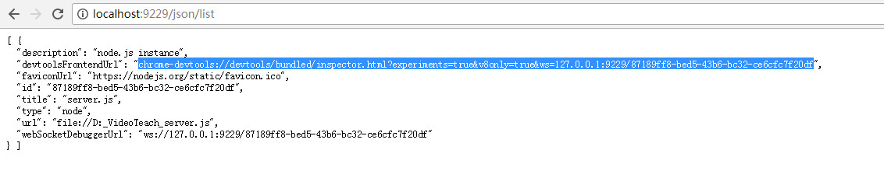

# JS 常用代码片段


## 安装依赖
```
# [jest](https://jestjs.io/docs/zh-Hans/getting-started.html)
cnpm i -S jest

# [babel](https://www.babeljs.cn/)
cnpm i --D babel-cli babel-preset-env
```


## inspector nodejs 谷歌浏览器调试
* 安装依赖
```
cnpm i -g node-inspector@0.7.5

# 用法
node --inspect-brk=9229 xx.js
node --inspect xx.js
```
* 打开谷歌浏览器，输入地址：http://localhost:9229/json/list

   

  ##### 注：其中9229为node后台调试的默认端口，这个地址可以查询到可用的调试服务信息 

* 将上图中标记的地址粘贴到浏览器中即可 

* 或者打开chrome://inspect/#devices查看


## 在线代码编辑器 [JSBEN](http://jsbin.com/?js,console)


## 开发工具Visual Studio Code
* ctrl+alt+d 生成Document This 注释